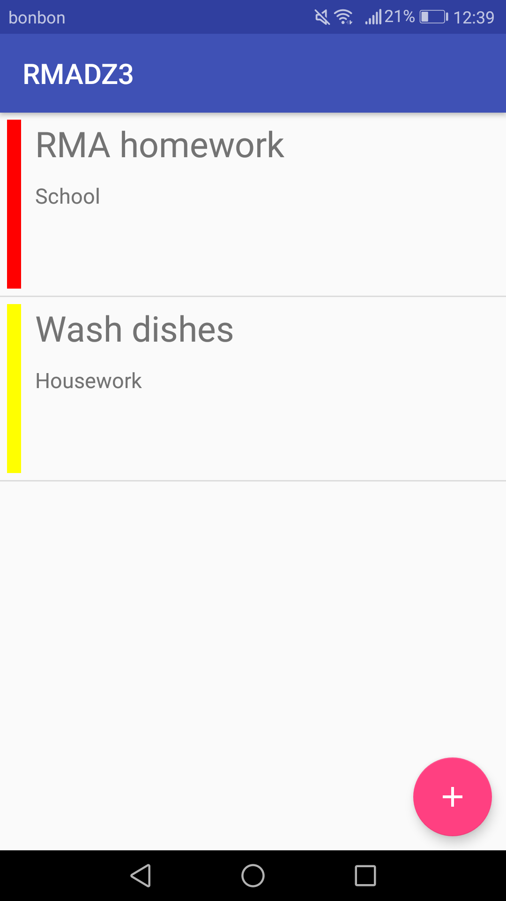
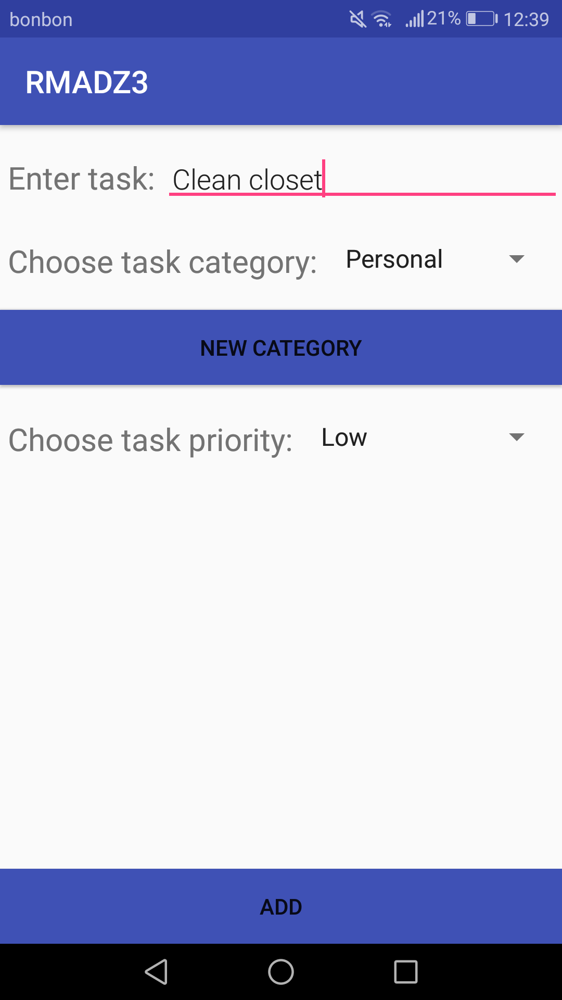
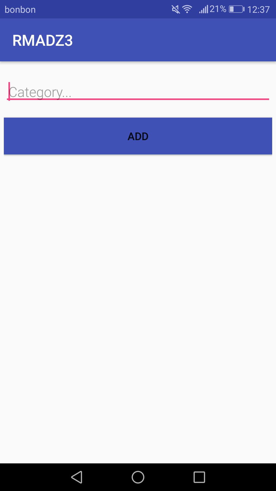
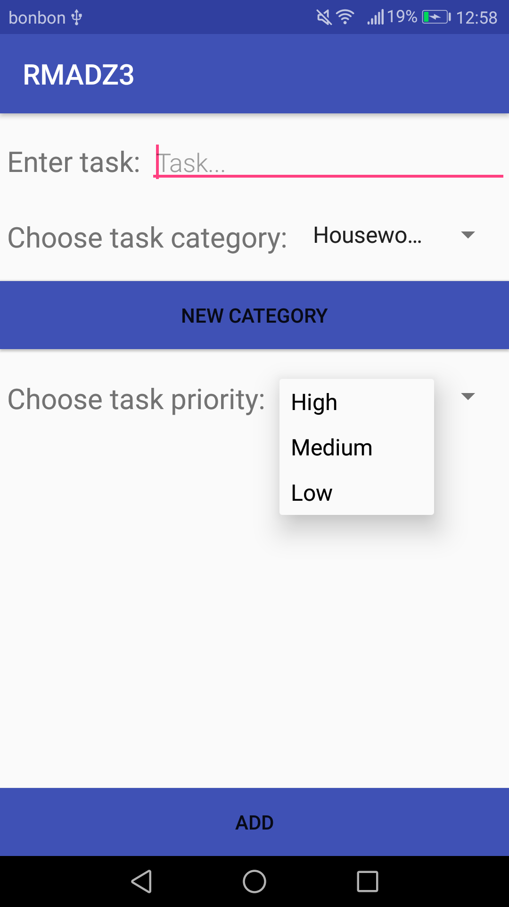
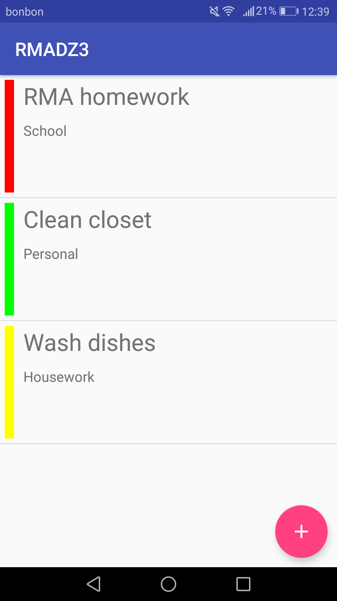

# RMA - DZ3

### The assignment and problems encountered

The assignment was to create an application which uses a simple database to track the user's to do tasks. The user can input and delete their own tasks and also input new categories by which the tasks are sorted. The application uses a *Room database* and it shows all tasks in a *RecyclerView*.

The main problem was implementing the database architecture and understanding what compomenent does what. For easier understanding and implementation, an example from [CodeLabs](https://codelabs.developers.google.com/codelabs/android-room-with-a-view) was used. 


### Utilised snippets/solutions/libraries/SO answers

* [ButterKnife](http://jakewharton.github.io/butterknife/) 

```gradle
implementation 'com.jakewharton:butterknife:8.8.1'
annotationProcessor 'com.jakewharton:butterknife-compiler:8.8.1'
```

* RecyclerView
```gradle
implementation "com.android.support:recyclerview-v7:${rootProject.ext.androidSupportVersion}"
```

* Room Database
```gradle
implementation "android.arch.persistence.room:runtime:${rootProject.ext.roomVersion}"
annotationProcessor "android.arch.persistence.room:compiler:${rootProject.ext.roomVersion}"
```

* LifeCycle components
```gradle
 implementation "android.arch.lifecycle:extensions:${rootProject.ext.archVersion}"
annotationProcessor "android.arch.lifecycle:compiler:${rootProject.ext.archVersion}"
```

* Versions defined in build.gradle:
```gradle 
ext {
    androidSupportVersion = "27.1.0"
    archVersion = "1.1.1"
    roomVersion = "1.0.0"
}
```


### Screenshots

<p align="middle">



<br>



